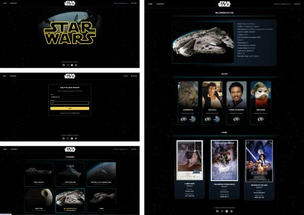

# Starships of Star Wars (Angular)

<p align="center">
  
</p>

## 📄 Descripción

Este repositorio contiene una aplicación **Starships of Star Wars** desarrollada con **Angular**. Permite a los usuarios visualizar información sobre naves, sus pilotos y películas de la saga en las que aparecen mediante el consumo de una API externa.

## ✨ Características

- **Exploración de Datos**: Consulta información detallada sobre naves, pilotos y películas de Star Wars.
- **Autenticación con Firebase**: Registro e inicio de sesión de usuarios utilizando Firebase Authentication.
- **Interfaz Moderna con Tailwind CSS y Animaciones Personalizadas**: Diseño responsivo con Tailwind CSS y estilos personalizados con animaciones CSS.
- **Diseño Responsive**: Adaptado para su uso en dispositivos móviles y de escritorio.
- **Despliegue en Vercel**: Aplicación alojada en [Vercel](https://starships-star-wars.vercel.app/). ¡Puedes probarla directamente desde tu navegador!
  - Si no deseas crear un usuario, puedes utilizar las siguientes credenciales de prueba:
    - **Email**: `test@email.com`
    - **Contraseña**: `123456`

## 💻 Tecnologías Utilizadas

- **Angular CLI** version 19.0.7.
- **Tailwind CSS** para el diseño y la maquetación.
- **CSS Personalizado con Animaciones** para mejorar la experiencia de usuario.
- **Firebase Authentication** para la autenticación de usuarios.
- **HTML5**
- **TypeScript**

## 📋 Requisitos

- **Node.js** y **npm** instalados en tu sistema. Descárgalos desde [nodejs.org](https://nodejs.org/).
- Angular CLI instalado globalmente:
  ```bash
  npm install -g @angular/cli
  ```

## 🛠️ Instalación

### **✔️ Requisitos previos**
Asegúrate de tener **Node.js** instalado en tu sistema. Puedes descargarlo desde [nodejs.org](https://nodejs.org/).  
ℹ️ **No es necesario instalar Angular CLI globalmente**, ya que se instalará automáticamente con las dependencias del proyecto.

### **✔️ Instalación paso a paso**

**1️⃣ Clona este repositorio en tu máquina local:**
```bash
git clone https://github.com/basantades/S7.-StarWars-Angular.git
```

**2️⃣ Desvincula el repositorio del control remoto original (opcional):**
```bash
git remote remove origin
```
Este paso es útil si planeas trabajar en tu propia versión del proyecto y no deseas mantener la conexión con el repositorio original.

**3️⃣ Ingresa al directorio del proyecto:**
```bash
cd S7.-StarWars-Angular
```

**4️⃣ Instala las dependencias necesarias:**
```bash
npm install
```

Esto instalará todas las dependencias necesarias, incluyendo Angular CLI.

## ▶️ Ejecución

Antes de iniciar la aplicación, debes configurar las credenciales de Firebase ([guía aquí](https://firebase.google.com/docs/web/setup)). En la carpeta `environments/` encontrarás un archivo `environment.example.ts`. Sigue estos pasos:

1. Abre el archivo environment.example.ts, que tiene la siguiente estructura:

```typescript
export const environment = {
    production: false,
    firebaseConfig: {
        apiKey: "",
        authDomain: "",
        projectId: "",
        storageBucket: "",
        messagingSenderId: "",
        appId: ""
    }
};
```
2. Completa los valores de firebaseConfig con las credenciales de tu proyecto en Firebase.
3. Renombra el archivo de environment.example.ts a environment.ts.


Para iniciar la aplicación en un entorno de desarrollo, ejecuta:
```bash
ng serve
```
Luego, abre tu navegador y navega a `http://localhost:4200/` para ver la aplicación en acción.

## 🧪 Pruebas

Se han creado pruebas unitarias para los siguientes componentes de la aplicación:

- **AppComponent**: Realiza las pruebas del componente principal de la aplicación.
- **ListStarshipsComponent**: Asegura que los datos de las naves se muestren correctamente.
- **PilotsComponent**: Verifica que los datos de los pilotos se carguen y muestren correctamente, y también que se manejen los errores en caso de problemas con la carga de datos.

Puedes ejecutar las pruebas con el siguiente comando:

```bash
ng test
```

## 🤝 Contribuciones

Si deseas colaborar en este proyecto o reportar algún problema, sigue estos pasos:

1. Crea un **issue** para reportar errores o sugerir mejoras.
2. Envía un **pull request** con tus contribuciones.
3. Asegúrate de seguir las **buenas prácticas** de desarrollo y de probar tus cambios antes de enviarlos.

---

Este README proporciona una guía básica para configurar, utilizar y contribuir al proyecto **S7.- StarWars (Angular)**. Asegúrate de consultar la documentación oficial de Angular, Firebase y Tailwind para obtener información más detallada y actualizaciones.
